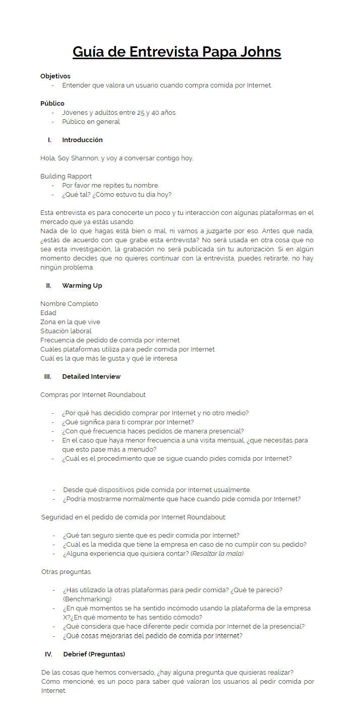
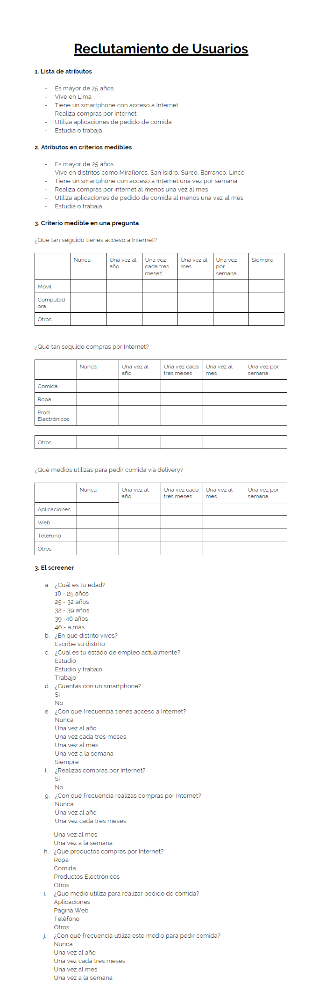

# Reto Papa Johns

## **El reto**

Papa Johns te ha contratado para que los ayudes a liderar una investigación con usuarios. Quieren entender qué valora un usuario cuando compra comida por internet. Elabora una guía de entrevista para esta investigación. También, haz un screener para reclutar usuarios para estas entrevistas.

## **Objetivo**

- Entender que valora un usuario cuando compra por Internet.

## **Herramientas**

- Guía de Entrevista
- Screener de Reclutamiento de Usuarios

### *Guía de Entrevista*

### *Reclutamiento de Usuarios*

## **Elaborado por**

Shannon Rivera